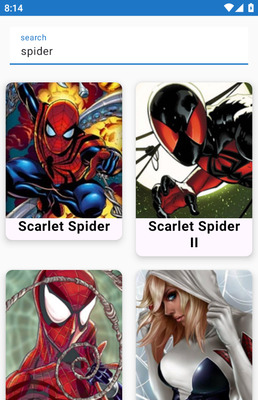
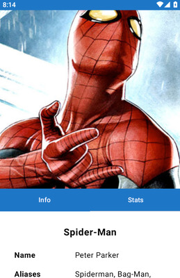
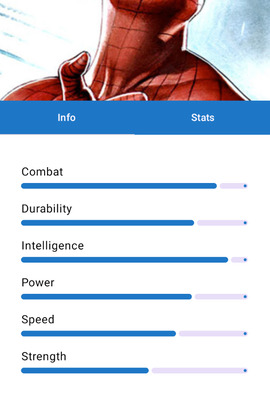

# HeroDaggerMVI

Aplicación móvil desarrollada en Kotlin, que consume la [superhero-api](https://akabab.github.io/superhero-api/api/)

## Funcionalidades
- Pantalla de detalles para cada superhéroe.
- Arquitectura basada en **MVI** (Model-View-Intent) utilizando **Orbit MVI**.
- Navegación basada en **Jetpack Compose Navigation**.
- Inyección de dependencias mediante **Dagger Hilt**.
- Consumo de API con **Retrofit**.

## Arquitectura
El proyecto sigue el patrón de arquitectura MVI:
- **Model**: Gestión de los datos y la lógica de negocio.
- **View**: Interfaz de usuario creada con Jetpack Compose.
- **Intent**: Manejo de los estados de UI y side-effects mediante [Orbit MVI](https://github.com/orbit-mvi/orbit-mvi).

## Capturas de Pantalla

    
    
    

